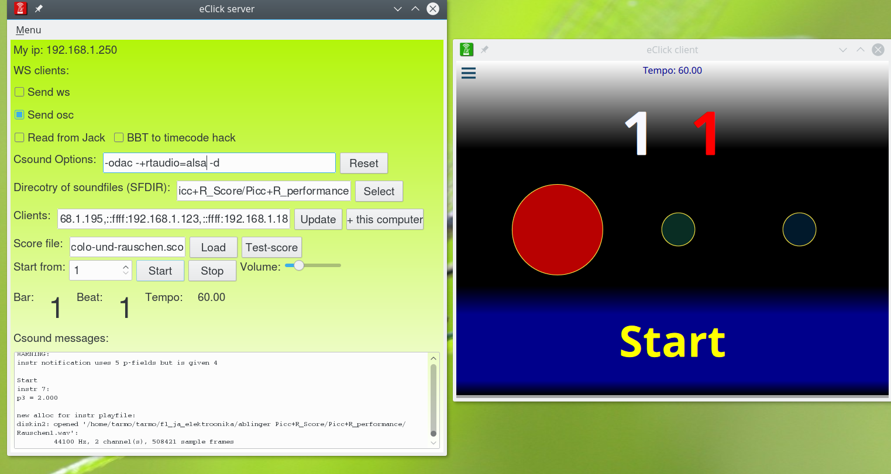

eClick 0.2.0 released!
###################################

:date: 2017-04-24
:slug: release_0.2.0
:author: Tarmo Johannes
:tags: release
:category: News

After lots of work, feedback from users, numerous improvements and changes in code  **eClick version 0.2.0 is out and ready for downloads**.

   
`eClick <pages/about.html>`_ is a free wireless visual click-track system for musicians.   

Version 0.2.0 seems to be fully functional and ready to use. Nevertheless it needs still more testing - be careful in mission critical situations!

Please `download <pages/getting-download.html>`_, try out and let know how it goes!

See more: `Getting started <pages/getting-started.html>`_

Read more about improvements from `here <https://github.com/tarmoj/eclick/blob/master/release_notes/Release%20notes%200.2.0.md>`_   

tarmo

